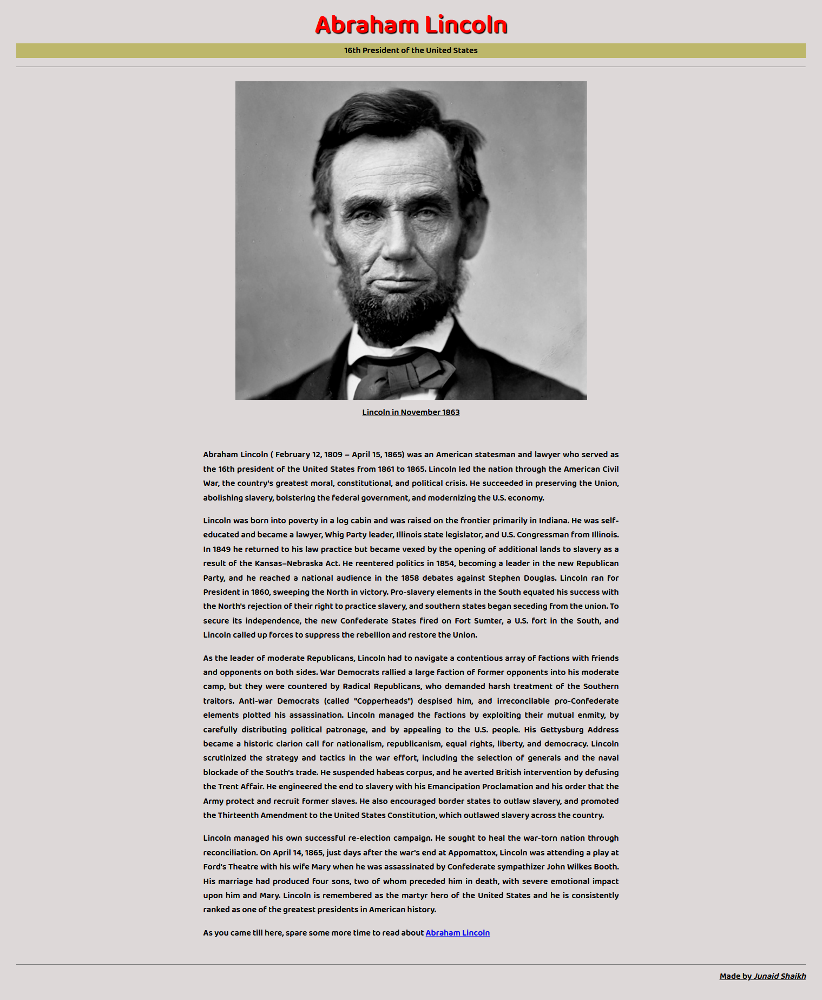

# FreeCodeCamp - Tribute Page

This is a solution to the [Build a Tribute Page](https://www.freecodecamp.org/learn/responsive-web-design/responsive-web-design-projects/build-a-tribute-page).

## Table of contents

- [Overview](#overview)
  - [Preview](#preview)
  - [The challenge](#the-challenge)
  - [Links](#links)
- [My process](#my-process)
  - [Built with](#built-with)
  - [What I learned](#what-i-learned)
- [Author](#author)

## Overview

This challenge is a part of FreeCodeCamp's Responsive Web Design certification course.

### Preview

### The challenge

Various user stories mentioned in the challenge need to be fulfilled.

### Links

- Solution URL:(https://github.com/junaidshaikh-js/tribute-page)
- Live Site URL:(https://junaidshaikh-js.github.io/tribute-page/)

## My process

### Built with

- Semantic HTML5 markup
- CSS custom properties

### What I learned

This is my very first challenge in the journey of web developement. After completing the responsive web desing course, this was the challenge to test my knowledge of HTML and CSS. In this challenge I used various semantic elements of html and different selectors to style them. 

## Author

- Linkedin Profile - [Junaid Shaikh](https://www.linkedin.com/in/junaidshaikhjs/)
